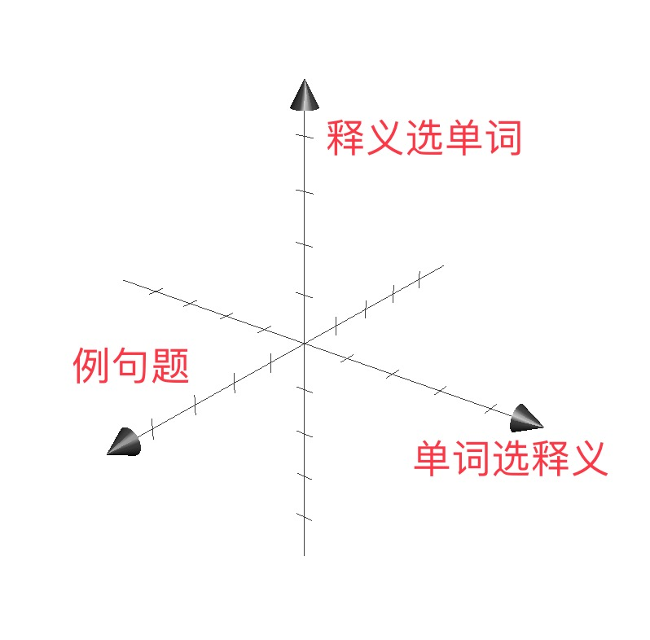

# Munin
智能背词算法

## 使用方式

打开[Munin智能背词](http://munin.tech:3389/index/),注册账号并登陆。

进入[数据管理](http://munin.tech:3389/data/)页面,点击"初始化数据",这一步将从原始词库中随机抽取20个单词到你的个人词库中,作为你的测试单词。

导入数据之后,你就可以在[单词列表](http://munin.tech:3389/mark/word_list/)页面看到刚才导入的数据了。

回到[首页](http://munin.tech:3389/index/),点击"开始背词",会从你的词库中随机抽取10个词来出题。

每个单词都会生成三种类型的题目各一个:

- 单词选释义
- 释义选单词
- 例句挖空题

每次做题时,都会将做题记录计入到数据库中,包括:

- 做题结果(对或错)
- 做题时间
- 题目的题型

当完成几轮测试之后,进入到[单词列表](http://munin.tech:3389/mark/word_list/),来手动标记单词的熟悉度。

标记单词会计入以下数据:

- 标记时间
- 标记的类别(认识或不认识)

标记熟悉度之后,再次回到首页做题,生成一部分做题记录,这部分做题记录就可以作为我们需要预测的数据。

数据准备充足之后,回到[数据管理](http://munin.tech:3389/data/)页面,点击最下方的"开始训练",就会将数据带入训练算法,并对新产生的数据进行预测,预测结果也会进行展示。

## 实现原理

### 原始数据格式

原始数据样本为每个单词的做题记录,格式如下:

|单词id|标记熟悉度时间|标记结果|最近5道题目的做题记录|
|:--|:--|:--|:--|
|16|1489027750|2|...|
|12|1489027810|2|...|
|11|1489027840|2|...|
|...|

其中`最近5道题目的做题记录`格式如下:

|做题结果|题型|做题时间|
|:--|:--|:--|
|true|sent2word|1489027723|
|true|def2word|1489027725|
|true|word2def|1489027649|
|...|

**注意:** 有的单词可能没有做够5条记录,那么有几条记录,就记录几条,最多记录5条。记录按照时间将序排列选取。

### 训练数据格式

构建单词做题记录的向量,每个维度代表一种题型,用正负代表做题结果(对错),长度代表做题的时间点距离标记时的时间点的差值。

将一个词的多个题型的记录进行向量加法操作,得出一个表示单词状态的整体向量,例如:

`[ -32709 32794 -32707]`

每个向量对应这一组的多个做题记录最后标记的一个单词掌握程度:1表示掌握,2表示未掌握

然后再根据其他单词的最新做题记录来预测其掌握程度。

### 运行环境

pip3 install django

pip3 install djangorestframework

pip3 install markdown

pip3 install django-filter

pip3 install pygments

pip3 install django-users2

pip3 install coreapi

pip3 install numpy

pip3 install tensorflow